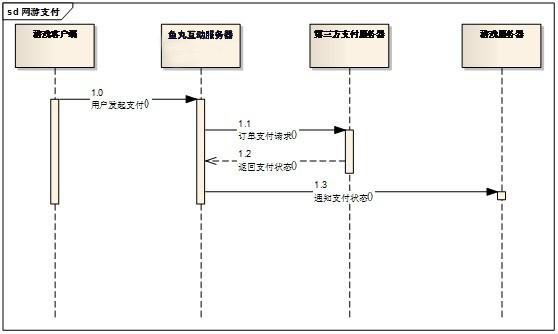

#服务端对接说明
------
##1.游戏支付流程
PK玩SDK支付流程图如下所示: 

 

##2.游戏支付结果通知

PK玩SDK支付提供电话卡支付，支付宝支付和银联等多种支付方式.
支付结果通知方式:

①支付成功: 
当游戏使用上述两种方式支付成功之后,PK玩SDK服务器会发送一次通知到游戏服务器(NoticeUrl),通知游戏支付成功.游戏服务器收到PK玩SDK发送的支付成功通知请求之后,需要立即输出一个“success”字符串,PK玩SDK服务器接收到“success”字符串默认通知游戏服务器成功。（如果没有在订单发起通知中传递NoticeUrl，PK玩SDK服务器将会通知游戏服务器提供的默认地址）
收到游戏服务器返回的“success”之后,支付跳转到支付成功界面,显示支付成功.同时页面上自动调用客户端支付通知接口通知客户端支付成功. 
支付成功时,PK玩SDK服务器通知游戏服务器的相关链接和参数如下:

|参数|含义|
|:---|:---|
|game_id|	商户ID|
|order_id|订单ID|
|total_fee|订单金额，单位：元|
|tran_code|交易码|
|enc_string|	通知加密字符串其中enc_string是 商户ID,订单ID,订单金额,商户密钥四个字符串连接之后用MD5加密生成的字符.EncString= MD5(game_id.order_id.total_fee.AppSecret)(注：字符传拼接为PHP方式的写法，下同);|
|user_id|用户uid|
|pay_status|	支付状态码 (0为支付成功,只有支付成功才会通知游戏服务器)
|note|	即支付注释（客户端API参数中通过setNote设置） 购买时客户端应用通过API传入，原样返回给应用服务器，开发者可以利用该字段，定义自己的扩展数据。例如区分游戏服务器|
PK玩SDK服务器发送的请求链接如下示例:
http:// NoticeUrl? game_id=xx&order_id=xx&total_fee=xx&tran_code=xx
&enc_string=xx&user_id=xx&pay_status=xx&note=xx
其中NoticeUrl为游戏服务器地址。地址可以在订单参数中设置，如果订单信息中未提供该参数，则通知厂商提供的默认游戏服务器地址。

②支付失败:
支付失败时,PK玩SDK服务器不会通知游戏服务器支付失败相关信息.
支付失败,直接在失败页面自动调用客户端支付通知接口通知游戏支付失败.
##3.检查用户登录Token是否有效
PK玩SDK支付也提供用户登录验证：

|参数|含义|
|:---|:---|
|appid  |商户ID|
|token	|用户的登录token|
|sign	|通知加密字符串其中EncString是 商户ID,Token,商户密钥三个字符串连接之后用MD5加密生成的字符串.EncString= MD5("appid=xx&token=xx&appsecret=xx");|
请求地址为：http://sdk.yuwan8.com/index.php/user_center

游戏服务器发出请求后，PK玩SDK服务器会验证sign是否有效,验证token是否有效,然后返回结果给游戏服务器。
PK玩SDK服务器返回的参数如下：
登录成功
{"code":0,"data":{}}
登录失败
{"code":2,"error":"appid无效"}

|参数|含义|
|:---|:---|
|code|	错误码(0=失败,1=成功,2=MerId无效,5=EncString无效,11=Token无效)|
|error|	错误描述|
|data| 成功登录时返回的数据|
