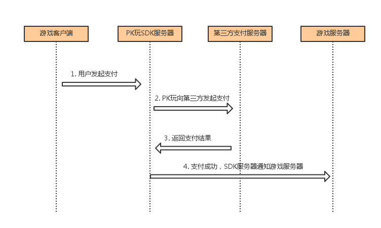

# 服务端对接说明
------
## 1.游戏支付流程
PK玩SDK支付流程图如下所示: 

 

## 2.游戏支付结果通知

PK玩SDK支付提供电话卡支付，支付宝支付和银联等多种支付方式.
支付结果通知方式:

①支付成功: 
当游戏使用上述两种方式支付成功之后,PK玩SDK服务器会发送一次通知到游戏服务器(NoticeUrl),通知游戏支付成功.游戏服务器收到PK玩SDK发送的支付成功通知请求之后,需要立即输出一个“success”字符串,PK玩SDK服务器接收到“success”字符串默认通知游戏服务器成功。（如果没有在订单发起通知中传递NoticeUrl，PK玩SDK服务器将会通知游戏服务器提供的默认地址）
收到游戏服务器返回的“success”之后,支付跳转到支付成功界面,显示支付成功.同时页面上自动调用客户端支付通知接口通知客户端支付成功. 
支付成功时,PK玩SDK服务器通知游戏服务器的相关链接和参数如下:

|参数|含义|
|:---|:---|
|game_id|	商户ID|
|order_id|CP订单ID|
|total_fee|订单金额，单位：分|
|tran_code|PK玩订单号|
|enc_string|签名（CP服务端收到回调后需验证该参数）|
|user_id|用户uid|
|pay_status|	支付状态码 (1为支付成功,只有支付成功才会通知游戏服务器)|
|note|	透传参数（客户端API参数中通过setNote设置） 购买时客户端应用通过API传入，原样返回给应用服务器，开发者可以利用该字段，定义自己的扩展数据。例如区分游戏服务器|
PK玩SDK服务器发送的请求链接如下示例:
http:// NoticeUrl? game_id=xx&order_id=xx&total_fee=xx&tran_code=xx
&enc_string=xx&user_id=xx&pay_status=xx&note=xx
其中NoticeUrl为游戏服务器地址。地址可以在订单参数中设置，如果订单信息中未提供该参数，则通知厂商提供的默认游戏服务器地址。

签名生成规则：
  1. 除enc_string外，所有回调参数均参与签名
  2. 字符串以key=value的形式拼接，多个字符串之间以“&”连接。如：gamg_id=xxx&order_id=xxx
  3. 字符串拼接时以key的字母升序排序
  4. 回调参数拼接完成后，同样以“&”连接加上app_secret=xxx(app_secret为商户密钥，由PKWan运营人员提供)，然后MD5生成签名串

②支付失败:
支付失败时,PK玩SDK服务器不会通知游戏服务器支付失败相关信息.
支付失败,直接在失败页面自动调用客户端支付通知接口通知游戏支付失败.
##3.检查用户登录token是否有效
PK玩SDK支付也提供用户登录验证：

|参数|含义|
|:---|:---|
|app_id  |商户ID|
|token	|用户的登录token|
|sign	|知加密字符串其中sign是 商户ID,token,商户密钥三个字符串连接之后用MD5加密生成的字符串.sign= MD5("app_id=xx&token=xx&app_secret=xx");|
请求地址为：http://sdk.pkwan.cn/api/user/profile，请求方式：GET

游戏服务器发出请求后，PK玩SDK服务器会验证sign是否有效,验证token是否有效,然后返回结果给游戏服务器。
PK玩SDK服务器返回的参数如下：

|参数|含义|
|:---|:---|
|code|	错误码(0为成功，非0为失败)|
|message|	错误描述|
|data| 成功登录时返回的数据|

登录成功
{"code":0,"data":{
  "user-id":"xxx",
  "avatar":"xxx",
  "nickname":"xxx",
  "gender":"xxx",
  "isRealName":true,
  "isAdult": true
}}

登录失败
{"code":2,"message":"xxx"}

|code|含义|
|:---|:---|
|0|	成功|
|2|	签名错误|
|4| 非法的token|
